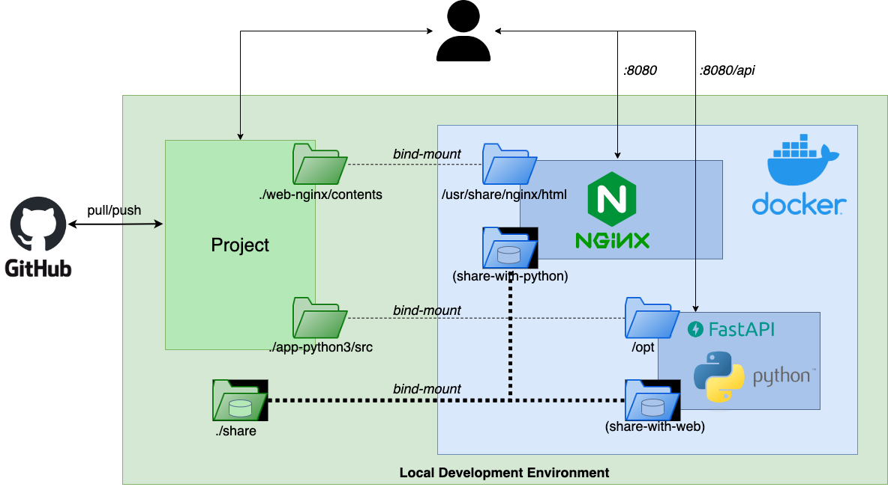

# Tsunagaru
Web site to introduce the laboratories of the Graduate School of Informatics, Osaka Metropolitan University, Japan.

# Requirements
Only `docker` and `docker-compose` commands are required. Please install these two commands according to <a href="https://docs.docker.com/">Docker Documentation</a>.

# Getting Started
> Note: Use port `8080` on localhost to access the launched Web site by default. If port `8080` on your machine is inconvenient, please change all the `8080` written in the following files as needed:
> - ``8080:80`` in the file ``docker-compose.yaml``
> - ``http://localhost:8080`` in the file ``app-python3/src/main.py``

In the beginning, type the following command to start two containers: `omu-nginx-container` and `omu-python-container`, which will take tens of minutes to complete some jobs of downloading or creating a docker image, installing apt packages and pip modules, etc.
```sh
$ docker-compose up -d --build
```

Once two containers are successfully created, you can access the Web site. Try typing the following URL in the address bar of a web browser such as Google Chrome.
```sh
localhost:8080
```
or
```sh
http://localhost:8080
```
> Note: If you do not have access to the launched Web site, please let us know via Univ. Email.

When you have access to the Web site, you can visit the introduction pages of Osaka Metropolitan University and the laboratories of Graduate School of Informatics. We hope you enjoy it.

At the end, type the following command to remove the containers and clean all the environment.
```sh
$ docker-compose down
```

# Detail Views
Below is a brief description of the implementation details. Please read only the sections that interest you.
## Image Materials
| Logo | Virtual Background |
|------|----------------|
|  |  |

## Architecture
<div align="center">

</div>

## Directory Layout
This is an overview of the directory tree. Hence, only major files and directories are shown here.
<pre>
.
├── app-python3
│   ├── src
│   │   ├── main.py
│   │   ├── (share-with-web)
│   │   └── wordcloud_omu_labos
│   ├── Dockerfile
│   └── requirements.txt
├── images
├── share
├── web-nginx
│   ├── conf.d
│   └── contents
│       ├── img
│       ├── index.html
│       ├── (share-with-python)
│       └── style.css
├── README.md
└── docker-compose.yml
</pre>

### docker-compose.yml
#### app-python3-svc
- Accessing port `8001` on the local host leads to port `8080` on `omu-python-container`.
- The files you want to **code** such as ``.py`` will be stored in ``./app-python3/src`` on the localhost which is bind-mounted into ``/opt`` on the python container.
#### web-nginx-svc
- Accessing port `8080` on the local host leads to port `80` on `omu-nginx-container`.
- The files you want to **code** such as ``.html``, ``.css``, ``.js`` will be stored in ``./web-nginx/contents`` on the localhost which is bind-mounted into ``/usr/share/nginx/html`` on the nginx container.
#### volumes
- The contents of three directories ``share``, ``share-with-web`` and ``share-with-python`` are shared immediately.


### app-python3
- This is the directory for managing the python container.
- Use python v3.9 to use WordCloud library (though latest version is v3.11)
- The pip modules necessary to install are listed in ``requirements.txt``.
- In ``main.py``, use FastAPI to have the python process run in the background by simply clicking on a URL embedded in the Web site.
- Three main steps are required to create WordCloud image: scraping, morphological analysis, and WordCloud image creation. ``run.sh`` handles them all at once.
- The created WordCloud image will be copied to the shared directory ``share-with-web``.

### web-nginx
- This is the directory for managing the nginx container.
- You can edit HTML, CSS, and JavaScript files in ``contents``.
- By configuration file ``conf.d``, the nginx container also act as a reverse proxy to forward requests destined for the `:8080/api` to the python container
- ``img`` is the place to store the originally prepared images, while ``share-with-python`` is the place to store the python products such as WordCloud image.